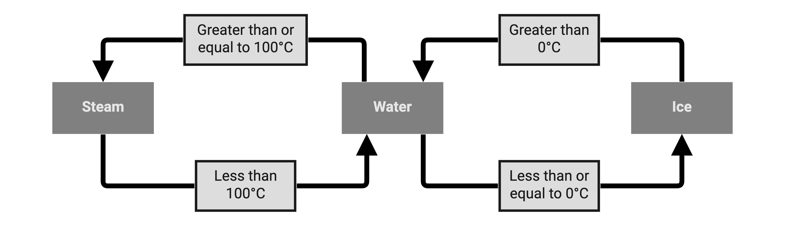
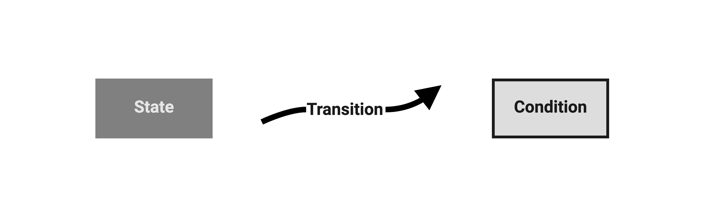
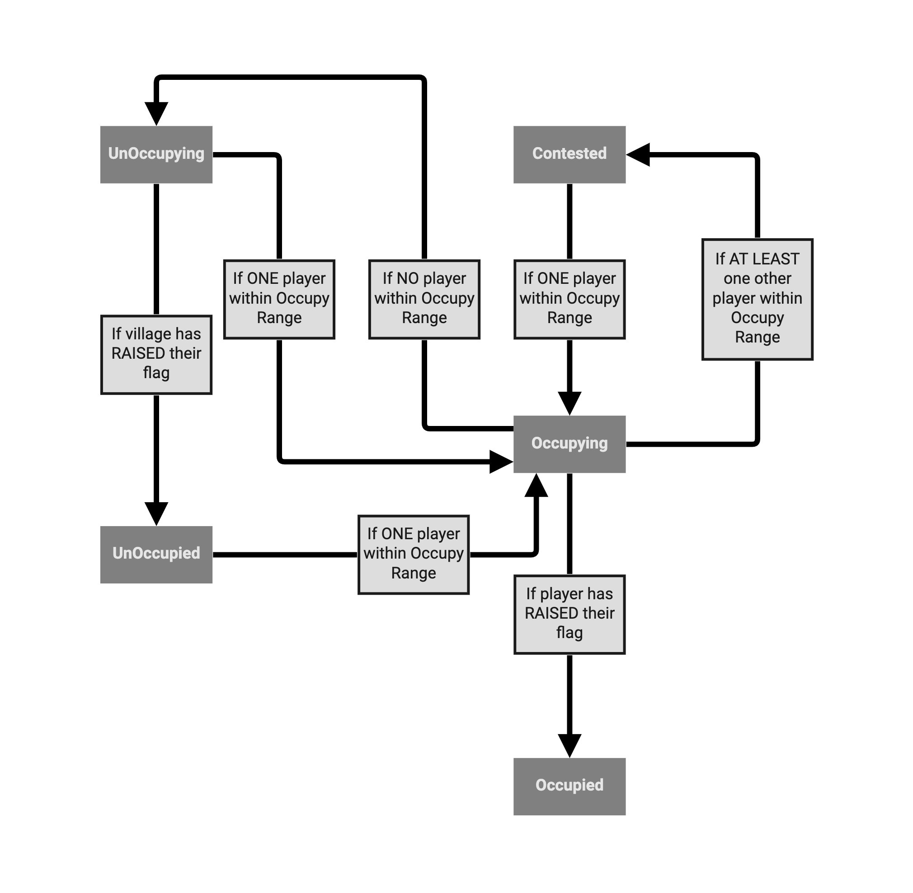

I wanted to implement a capture the flag game mechanic for my yet to be named game, which like many other projects of mine, will most likely disappear into obscurity.

The game itself is a [MOBA](https://en.wikipedia.org/wiki/Multiplayer_online_battle_arena) (_Multiplayer Online Battle Arena_) where up to (_a yet to be determined number of_) players battle it out. Placed around the map will be villages that can be captured, granting the occupying player a trait (_a buff or skill_) and spawning NPCs (_Non Player Characters_) that will head off into the wilds in search of fame and glory.

How might one build such a game mechanic, you might ask? Whilst there are many ways to skin a cat, per se, I have chosen to build the logic using a behavioural model called a State Machine or Finite State Machine.

What we'll cover:

- [What is a Finite State Machine?](#what-is-a-finite-state-machine)
- [Identifying the behaviours of capturing a village](#identifying-the-behaviours-of-capturing-a-village)
- [Conceptualising our Finite State Machine](#conceptualising-our-finite-state-machine)
- [Coding our State Machine](#coding-our-state-machine)
- [The end result](#the-end-result)

<a name="what-is-a-finite-state-machine"></a>

# What is a Finite State Machine?

A Finite State Machine (_FSM_) is an abstract machine that has a limited (_finite_) number of states. The machine can only be in one state at a time. Each state will have one or more conditions that will allow transition between one state and another.

As an example, we can create a rudimentary and simple FSM that we can all relate to that models how Water can transition to Steam or Ice.



Water cannot be both Water and Steam or Water and Ice. Ice cannot be Steam and vice versa.

When the temperature of Water reaches 0℃ it freezes and turns to ice, when it reaches 100℃ it boils and turns to steam.

When states and transitions can be represented in this way, a FSM is an excellent model to utilise. States, transitions and their conditions can be clearly defined and implemented, reducing the chance for error within the system and making the logic easily interpreted and understood by a human.

<a name="identifying-the-behaviours-of-capturing-a-village"></a>

# Identifying the behaviours of capturing a village

A FSM is a behavioural model, and thus, before we attempt to conceptualise it, we must first understand the representative behaviours and how we go from one to another.

My process for doing this is to write down a number of statements that describe the behaviours, transitions and conditions.

Below, I have created some statements where I have highlighted the key words that identify either a state, condition or transition.

- When **a player** comes close to an **un-occupied** village they can start **occupying** it.

- **A player** successfully **occupies** a village when they have **replaced** the village's flag with theirs.

- If **a player leaves** the village before it is **occupied**, the village will start **un-occupying** itself.

- An **un-occupying** village will quickly return to **un-occupied** once it has **replaced** the player's flag with its own.

- When **a player** comes close to an **un-occupying** village they can start **occupying** it.

- A village being **occupied** can be **contested** by **other players**.

<a name="conceptualising-our-finite-state-machine"></a>

# Conceptualising our Finite State Machine

Now that we have thought about our game mechanic and how it will behave, we can visualise the State Machine by drawing a flow chart.

Here is the legend:



Here is the State Machine I devised from the above statements:



<a name="coding-our-state-machine"></a>

# Coding our State Machine

Whilst my example is written for Unity, the concept can be applied to any game engine. It is worth noting that I have also translated my existing code, which is written to work for a multiplayer game using `Unity.Netcode`, into code for a standard, single player game.

The basic contract for states within a State Machine is:

- **On enter**. Provides a way for the state to perform an action(s) when it is first entered, such as play an animation or do some setup for the state.
- **On exit**. Provides a way for the state to perform an action(s) prior to exiting, such as clean-up.
- **On update**. Provides a way for the state to perform action(s) on each update to the frame, such as check some condition.

Of course, this can be expanded to include any number of hooks that make sense to you.

In C# an abstract class can be used to both specify a public API as well as perform anything common to all states.

```csharp
public abstract class VillageState
{
  public string Name => this.ToString().Split('.').ToList().Last();

  public virtual void OnEnter(IStateMachine stateMachine)
  { }

  public virtual void OnUpdate(IStateMachine stateMachine)
  { }

  public virtual void OnEnter(IStateMachine stateMachine)
  { }
}
```

Making the methods virtual will simplify the concrete classes and avoid you having to create empty methods when they are not needed.

An example of one of our states:

```csharp
using System.Linq;

public class UnOccupiedVillageState : VillageState
{
  public override void OnEnter(IStateMachine stateMachine)
  {
    stateMachine.PerformCoup();
  }

  public override void OnUpdate(IStateMachine stateMachine)
  {
    IPlayer[] occupiers = DetectOccupiers(stateMachine.VillageCentre, stateMachine.OccupyRange, stateMachine.PlayerMask);

    if (occupiers.Length == 0)
      return;
    else if (occupiers.Length == 1)
      stateMachine.PerformCoup(occupiers[0]);
      stateMachine.TransitionTo(stateMachine.States.Occupying);
    else
      stateMachine.TransitionTo(stateMachine.States.Contested);
  }

  private IPlayer[] DetectOccupiers(float villageCentre, float occupyRange, int playerMask)
  {
    return Physics
        .OverlapSphere(VillageCentre, CaptureDistance, _playerLayerMask)
        .Select((collider) => collider.gameObject.GetComponent<IPlayer>())
        .ToArray();
  }
}
```

In the above code sample of **UnOccupiedVillageState**, `DetectOccupiers` would most likely be a public method available on `IStateMachine` as it would likely be used in more than one state. It's really down to what makes sense for you. The State Machine is a construct that handles the running of the machine and provides a public interface exposing common functionality to it's states.

And an example of our State Machine:

```csharp
public class Village : MonoBehaviour, IStateMachine
{
  private VillageState _currentVillageState;
  private IPlayer _occupier;

  private void Awake()
  {
    PlayerLayerMask = 1 << LayerMask.NameToLayer("Player");
    States = new VillageStates()
    {
      Contested = new ContestedVillageState(),
      Occupied = new OccupiedVillageState(),
      Occupying = new OccupyingVillageState(),
      UnOccupied = new UnOccupiedVillageState(),
      UnOccupying = new UnOccupyingVillageState(),
    };
    _currentVillageState = States.UnOccupied;
  }

  private void Update()
  {
    if (_currentVillageState != default)
      _currentVillageState.OnUpdate(this);
  }

  public void PerformCoup()
  {
    _occupier = default;
  }

  public void PerformCoup(IPlayer player)
  {
    _occupier = player;
  }

  public int PlayerLayerMask { get; internal set; }

  public VillageStates States { get; internal set; }

  public void TransitionToState(VillageState state)
  {
    if (_currentVillageState != default)
      _currentVillageState.OnExit(this);

    _currentVillageState = state;
    _currentVillageState.OnEnter(this);

    Debug.Log($"Village transitioned to state {state.Name}");
  }

  public Vector3 VillageCentre => transform.position;
}

public interface IStateMachine
{
  void PerformCoup();
  void PerformCoup(IPlayer player);
  int PlayerLayerMask { get; internal set; }
  VillageStates States { get; internal set; }
  void TransitionToState(VillageState state);
  Vector3 VillageCentre { get; }
}

public struct VillageStates
{
  public VillageState Contested;
  public VillageState Occupied;
  public VillageState Occupying;
  public VillageState UnOccupied;
  public VillageState UnOccupying;
}
```

<a name="the-end-result"></a>

# The end result

Here is a gif showing the game mechanic in all its glory as it transitions through the five states we have discussed above.


I hope this was informative and useful. Leave a comment on one of my socials. Thank you!
